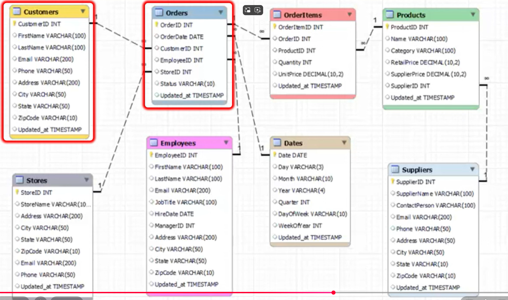

# DBT Introduction

## Activate Python Venv

```bash
    cd ./dbt_workspace
    python3 -m venv dbt_venv
    .\dbt_venv\Scripts\Activate.ps1 # (Windows)
    source ./dbt_venv/bin/activate # Linux
```

## Installing dbt-postgres

It is important to create the .dbt folder because inside it, it will create the profile file which contains all the necessay information for the connection

```bash
    pip install dbt-postgres
    dbt init
    mkdir ~/.dbt

```

## Raw Database



To populate the raw database in the model you can find the python script postgres_raw_populate.py


## Create the first model

```bash
cd ./dbt_workspace/oms_dbt_proj
dbt debug
dbt run
```

If everything works successfully you will see a view in the same database as the raw data. The default materialized mode is view but in dbt_project.yml you can change it as table. And then you can place this upon your query

```sql
{{ config(materialized='table') }}
```

If uou rerun the project it will create a table a delete the view

## Medallion Architecture

Instead of building a table like this

```sql
with customerrevenue as (
    select  c.customerid, 
            concat(c.firstname, ' ', c.lastname) as customername, 
            count(o.orderid) as no_of_orders,
            sum(oi.quantity * oi.unitprice) as revenue
    from customers c 
    join orders o on c.customerid = o.customerid
    join orderitems oi on o.orderid = oi.orderid
    group by c.customerid, customername
    order by revenue desc

)

select customerid, customername, no_of_orders, revenue
from customerrevenue
```

It would be more beneficial to create the "silver medaillion" so a place where we can start aggregating things before preparing them for the gold medallion

So we would like to have:

#### Bronze

Orders stg (View)
OrderItems stg (View)
Customers stg (View)

#### Silver

Orders fact (Table)

#### Gold

Customer Revenue (Table)

### The benefits of this approach includes:

- Readability
- Reusability
- Maintainability
- Scalability
- Testability

- View => Does not occupy additional storage space
- Table => Requires Sotage space
- View => Subsequent step may haev slower performance
- Table => Improved performance for subsequent step

## Create a separate schema

You can create a separate schema using a macro and select the schema of preference in the configuration

```yaml
models:
  oms_dbt_proj:
    # Config indicated by + and applies to all files under models/example/
    bronze:
      customers_stg:
        materialized: view
      orders_stg:
        materialized: view
      orderitems_stg:
        materialized: view
    silver:
      orders_fact:
        materialized: table
    gold:
      customerrevenue:
        materialized: table
        schema: olap
```


## Seeds

In dbt seeds are csv files can be quickly loaded into a data warehouse. For example in out data warehouse we completly miss the information about how many sales each store perform. Remeber the table will have the same name as the .csv file we created so in this case `salestargets.csv`

Once we create the file we can use the dbt seed command

```bash
dbt seed
```

We can reference the seed table like all other references

## Analysis

Unlike the Models sql in analysis are not materialized in the data warehouse. It is used to make queries using dbt syntax so with references and so on

## Sources

Sources are very important because allow us to create "variables" like table name or fields so if the dba team decide to change something we can just change the source without changing the whole code.

We can create a simple yaml file in our models folder and name it as we wish, for example `src_oms.yml`

and now we can replace with our sources everywhere. Using the following syntax

```yaml
{{ source('landing', 'cust') }}
```

## Tests

Within `dbt` there are two primarly type of tests:

- singular
- generic

For example:

### Singular Test

#### Business Expectation:

order_date <= ship_date


#### Query

```sql
select order_id
from {{ ref('online_orders') }}
where order_date > ship_date
```

The test is design to match where the business expectation is not reached

### Generic Test

#### Business Expectation

Do not have emails empty

#### Query

If we write the query like before (singular test) we could end up with somthing like this

```sql
select email
from {{ ref('customers') }}
where trim(email) = ''

select phone
from {{ ref('employees') }}
where trim(phone) = ''

select email
from {{ ref('suppliers') }}
where trim(email) = ''

```

This is not something very desirable because you're going to repeat yourself a lot. It would be better to write down a test in the following format:

```jinja2

select {{ column_name }}
from {{ model }}
where trim({{ column_name }}) = ''

```

This is what is called a generic test. 

#### Default generic test

Dbt comes with some default generic tesrt

- Not_null: Ensures no columns have null values
- Unique: Ensures each row in a table is unique
- Accepted_values: Ensures the column values are within the specified values
- Relationships: Ensures the relationships between tables are correct

### Orders fact test

#### Business Expectation

All Revenue are positive revenue. Since this logic is specific for this module, we can write down a singular test for it.
You can look at it in 
`./dbt_workspace/oms_dbt_proj/tests/orders_fact_negative_revenue_check.sql`

For the generic test we can create it both in `macro` folder and in `tests\generic` folder

We ask to check generic test in the model, `oms_config.yml` like the followinfg

```yaml
models:
  - name: customers_stg
    columns:
      - name: email
        tests:
          - string_not_empty
```


Additionaly you can also play tests in the the source file like this:

```yaml
sources:
  - name: landing
    database: analytics
    schema: public

    tables:
      - name: cust 
        identifier: customers 
        columns:
          - name: address
            tests:
              - not_null
              - string_not_empty
```

### Test Freshness

Additionaly sources can also be tests for freshness, to test it has been updated within a specified duration


```yaml
sources:
  - name: landing
    database: analytics
    schema: public

    freshness:
      warn_after: { count: 1, period: day }
      error_after: { count: 3, period: day }
    loaded_at_field: updatedat

    tables:
      - name: cust 
        identifier: customers 
        columns:
          - name: address
            tests:
              - not_null
              - string_not_empty
```

If not a warning or error is generated accordingly. We defined like this because all tables has a column name *updatedat* but you can also defined it at the table level. Rember to initialize this check you have to run the following command:

```bash
dbt source freshness
```

In a production environment it can be run inside a cron job

## Documentation

Dbt autogenerated documentation. The documentation is autogenerated but we can use custom descrition in our yaml file `oms_config.yml` we can add description into a model or a column

```yml
 - name: customers_stg
    description: Staged customer data from order management system (OMS), with minor row-level transformations
    columns:
      - name: email
        description: Customer's Primary Email address for promotions and offers
        tests:
          - string_not_empty
```

Similar we can add description to the sources, or in a block inside an .md file like in `oms_doc_blocks.md`. This approach can be really beneficial when you want to include formatted blocks. You can reuse your block anywhere else following the DRY (Don't Repeat Yourself) principle. For example the *StatusCD* block we defined in the file can be reused. In the yaml file 


```yml
      - name: statuscd
        description: "{{ doc('StatusCD') }}"
        tests:
          - accepted_values:
              values: ['01','02','03']
```

Now we can generate the documentation

```bash
dbt docs generate
```

The file oms_dbt_proj\target\catalog.json will be updated. To make this documentation accessible to anyone you can use the command

```bash
dbt docs serve
```

This will produce a comprehensive docs for the stakeholders

## Jinja in dbt

The ref functions we have been using so far is part of the jinja functions. Jinja is useful to make sql and yaml code dynamic.

### Jinja a quick resume

1. Everything which is wrapped within , is called *Control Statements*. For example

```jinja2

...
 ... 
```

2. Everything whcih is wrapped inside {{ ... }} is called *Expression*. For example:

```jinja2
{{ 10 + 20 }}
{{ variable_a }}
```

3. Everything written outside curly brackets is called *texts*. Which is simply printed

4. Everything which is wrapped within {# ... #} is a comment

You can see a resume of it in the following code

```jinja2
{# This Jinja code generates select statements to pring numbers from 0 to 9 #}


    SELECT {{ i }} AS number
    
        UNION
    

```

Which print SELECT 1 as number UNION SELECT 2 as number UNION SELECT 3 as number ... UNION SELECT 10 as number

### A practical Example

We want to populate our test environment using jinja